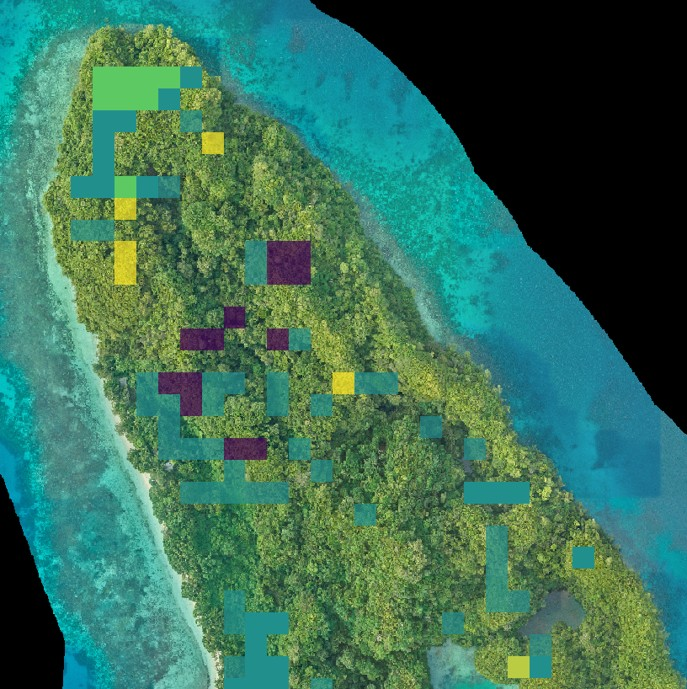

# Introduction

Islands make up only 6.7% of the Earth’s land surface area, but support approximately 20% of the world’s biodiversity [[1]](https://www.sciencedirect.com/science/article/pii/S2351989421003978?via%3Dihub). Island ecosystems evolved in isolation from the continental mainland and are made up of many endemic plant and animal species that are uniquely adapted to island life and found nowhere else in the world. This makes them highly vulnerable to environmental disturbance and introduced threats; as a result, islands support a high density of imperiled species  [[2]](https://academic.oup.com/bioscience/article-abstract/65/6/592/301848).

Protecting island ecosystems is crucial for conserving biodiversity. However, due to their geographic isolation and remoteness, many islands lack the long-term ecological data that is needed to support conservation and restoration initiatives. Without these data, land managers and conservation practitioners cannot monitor ecosystem change caused by the establishment of non-native species, natural resource use, or climate change. They also cannot assess outcomes of targeted conservation actions, such as the removal of an invasive species, planting of native vegetation, or reintroduction of an extirpated species. 

Satellites provide us with large-scale, long-term observations of the Earth’s surface. When data collected from ground surveys are sparse, outdated, or unavailable, satellite observations can fill the data gap, helping us better track ecosystem health and function. Island Vital Signs utilizes satellite data to monitor change in island vegetation communities and predict long-term vegetation trends. We provide these data through an online decision-support tool, where end-users can visualize vegetation change on over 50 islands worldwide and download rasters that can be used in mapping applications, including ESRI products (ArcGIS Pro, ArcGIS Collection, etc.), QGIS, and Avenza. 

```{r echo=FALSE, label="satellite-imagary-graphic", out.width='75%', fig.align = 'center'}


```

