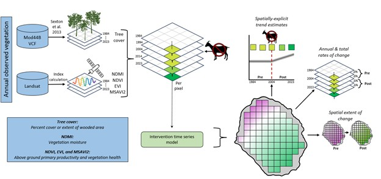

# Methods

```{r setup, include = FALSE}
library(tidyverse)
library(kableExtra)
```

## Analytical Workflow
```{r workflow, echo=FALSE, label="workflow-graphic", out.width='100%', fig.align = 'center'}


```


## Islands with available data
```{r island-lookup-table, echo = FALSE}
island.lookup <- read.csv("tables/island_lookup_table.csv")
knitr::kable(island.lookup, col.names = gsub("[.]", " ", names(island.lookup)), 
             align = "lllllllll") %>%
  kable_styling(font_size = 9.5)
```

