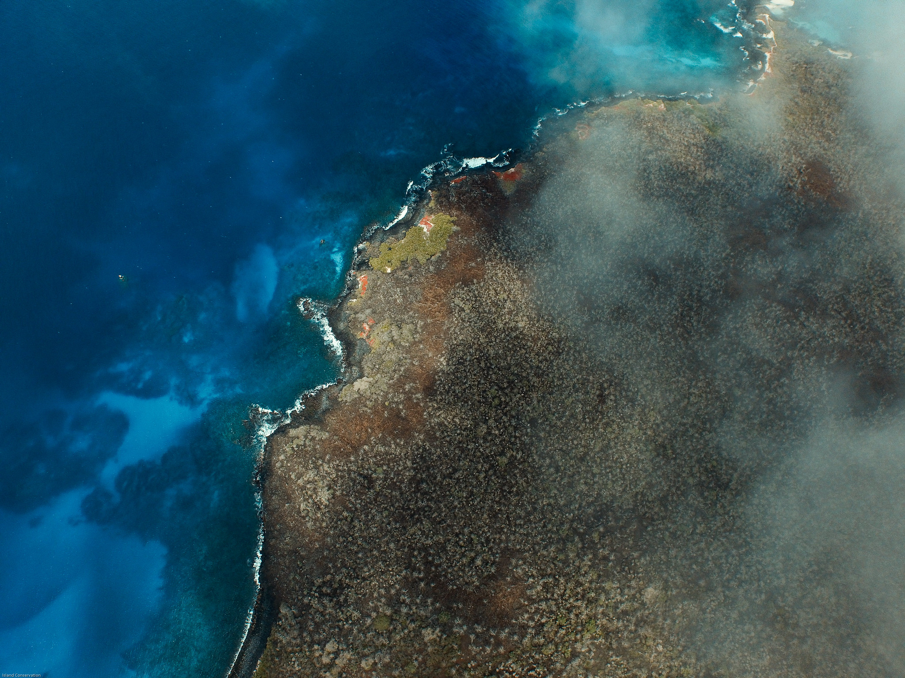
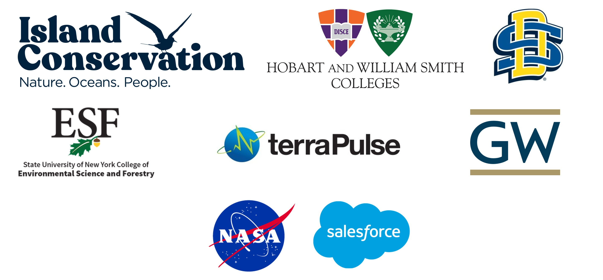

--- 
title: "Island Vital Signs: 
Turning satellite observations into actionable insights"
short_title: "Island Vital Signs"
author: "Mikayla Call (Hobart and William Smith Colleges), Elke Windschitl (Island Conservation), Brad Cosentino (Hobart and William Smith Colleges), Christy Wails (South Dakota State University), and David Will (Island Conservation)"
date: "`r Sys.Date()`"
site: bookdown::bookdown_site
---

# Preface { - }
Island Vital Signs is a tool that turns remotely sensed data into actionable insights that can contribute to conservation and restoration efforts on islands around the world. The purpose of this book is to provide an overview of the Island Vital Signs project and its methods, explain how to access data and use the Island Vital Signs online app to visualize results, and describe several use case studies that demonstrate real-world applications of the Island Vital Signs data in conservation decision-making. 


```{r echo=FALSE, label="Floreana-image", out.width='100%', fig.cap='Floreana Island, Galápagos, Ecuador (Tommy Hall/Island Conservation).'}


```


## Acknowledgements
The Island Vital Signs project was funded by Salesforce Nature Accelerator and NASA Biological Diversity and Ecological Conservation award 80NSSC23K1539. 

The Island Vital Signs project team includes members from Island Conservation (Santa Cruz, California), Hobart and William Smith Colleges (Geneva, New York), South Dakota State University (Brookings, South Dakota), State University of New York College of Environmental Science and Forestry (Syracuse, New York), terraPulse (Gaithersburg, Maryland), and George Washington University (Washington D.C.). 

All outputs presented in Island Vital Signs data are the result of models developed by team members from Hobart and William Smith Colleges and South Dakota State University using remotely sensed data products produced by terraPulse Inc. 

Thank you to Lara Brenner, Paula A. Castaño, Cielo Figuerola, Katie Franklin, Nick Holmes, Paul Jacques, John Knapp, Stefan Kropidlowski, Amy Levine, Annie Little, Cozette Romero, Alex Wegmann, Cameron Williams, and Coral Wolf for providing early feedback with regards to the framework design and assisting with model validation. 


```{r echo=FALSE, label="contirbutor-logos", out.width='100%'}


```


## Contacts
If you have questions about the Island Vital Signs project, please contact the following project team members:

+ David Will, Project PI – david.will@islandconservation.org
+ Elke Windschitl, App Development – elke.windschitl@islandconservation.org
+ Dr. Christy Wails, Model Development – christy.wails@sdstate.edu
+ Dr. Bradley Cosentino, Model Development – cosentino@hws.edu
+ Dr. Mikayla Call, End User Support – call@hws.edu

For inquiries about the remote sensing data products used in this project, please contact Dr. Joseph Sextin at sexton@terrapulse.com or visit terraPulse, Inc.'s website at https://terrapulse.com/
